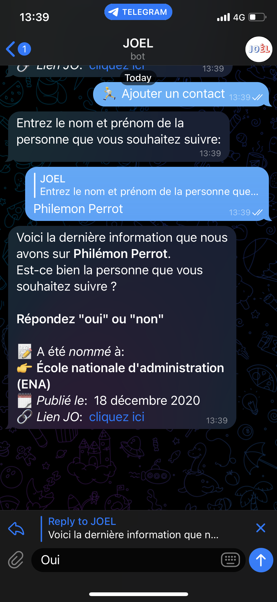
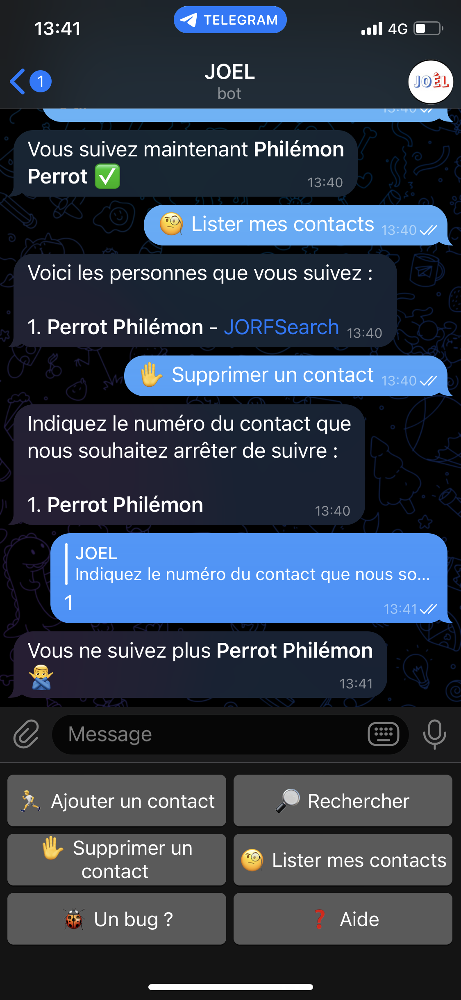

<!-- PROJECT LOGO -->
 

  
  <h3 align="center">Restez informé des nominations au JO de votre réseau	</h3>

<!-- TABLE OF CONTENTS -->

  
Table des matières

  <ol>
    <li>
      <a href="#about-the-project">A propos de ce projet</a>
      <ul>
        <li><a href="#built-with">Built With</a></li>
      </ul>
    </li>
    <li>
      <a href="#getting-started">Démarrer</a>
      <ul>
        <li><a href="#prérequis">Prérequis</a></li>
        <li><a href="#installation">Installation</a></li>
      	<li><a href="#utilisation">Utilisation</a></li>
	  </ul>
    </li>
    <li><a href="#contribuer">Contribuer</a></li>
	<li><a href="#bug"> Bug </a></li>
	<li><a href="#confidentialité"> Confidentialité </a></li>
    <li><a href="#contact">Contact</a></li>
    <!-- <li><a href="#acknowledgements">Acknowledgements</a></li> -->
  </ol>

## A propos de ce projet

On en avait marre de passer à côté de certaines nominations au Journal officiel de nos amis et collègues.   

Du coup, on a développé JOEL, un outil qui nous permet d'être informés des nominations au JO qui nous intéressent 👇   

En effet, à l’heure actuelle, la version électronique du JO ne permet pas de faire une veille personnalisée des nominations. 🤷‍♂️
  
On a donc créé un bot sur Télégram pour être tenus au courant quotidiennement des mentions au JO des personnes qu’on voulait suivre. 
  

JOEL c’est aussi:

<li> ⌨️ Une solution 100% open source</li>
<li> 💸 Un outil d’intérêt général sans but lucratif </li>
<li>🛡 Vos données sont anonymisées et ne sont pas réutilisées </li>
<li>🧩 Un nouvel élément de transparence et d’accessibilité du JO, dans la logique initiée par l’outil Jorfsearch de <a href="https://github.com/nathanncohen">Nathann Cohen</a> sur lequel est construit JOEL </li>
  🤔 Et pourquoi « JOEL »? 
En hommage au <a href="https://fr.wikipedia.org/wiki/Fichier:Publicit%C3%A9_3615_JOEL.png">3615 JOEL </a>, qui permettait de consulter le <b>J</b>ournal <b>O</b>fficiel <b>EL</b>ectronique sur Minitel 😉  

### Built With

JOEL se base sur le travail de <a href="https://github.com/nathanncohen">Nathann Cohen</a> qui a développé l'outil <a href="https://jorfsearch.steinertriples.ch/">JORFSearch</a> qui permet, entre autres, de faire des recherches nominatives sur le JO. 

<!-- Démarrer -->

## Démarrer

### Prérequis

JOEL requiert d'avoir téléchargé l'application Telegram.

### Installation

Suivez le lien <a href="https://t.me/JOEL_hellofabot">https://t.me/JOEL_hellofabot</a>.

### Utilisation

#### Rechercher une personne

Pour rechercher une personne, vous pouvez cliquer sur le bouton "🔍 Rechercher" qui vous renverra sa dernière nomination au JO.

  

#### Ajouter un contact

Pour ajouter un contact, cliquez sur le bouton 🏃‍♀️ puis insérer le prénom et le nom de la personne que vous souhaitez suivre.
JOEL vous demandera une confirmation du profil que vous souhaitez suivre. Si vous répondez oui, vous suivez désormais cette personne.

  

#### Supprimer un contact

Si vous souhaitez supprimer un contact, cliquez sur le bouton "🤚 Supprimer un contact".
La liste de vos contacts apparaît, il vous suffit alors d'entrer le numéro associé au contact à supprimer dans la liste.

#### Lister mes contacts

Pour lister vos contacts, cliquez sur le bouton "🧐 Lister mes contacts"

  

## Bug

En cas de bug, contactez @hellofabien ou hellofabien@pm.me en mentionnant votre identifiant Telegram (obtenu en cliquant sur le bouton "🐞")

## Confidentialité

JOEL ne cherchera jamais à vous identifier. Vos données sont anonymisées et ne seront jamais réutilisées. 🛡

## Contribuer

Toute contribution sera **grandement appréciée** 🤗

1. Forker le projet
2. Créer une branche feature ('git checkout -b feature/AmazingFeature')
3. Commiter les changement ('git commit -m 'Add some AmazingFeature')
4. Pusher dans la branche ('git push origin feature/AmazingFeature')
5. Ouvrir une Pull Request

## Contact

<a href="https://www.linkedin.com/in/fabien-rahaingomanana/">Fabien RAHAINGOMANANA</a>

<a href="https://www.linkedin.com/in/philemon-perrot/">Philémon PERROT</a>

<a href="https://dany.mestas.dev/">Dany MESTAS</a>
